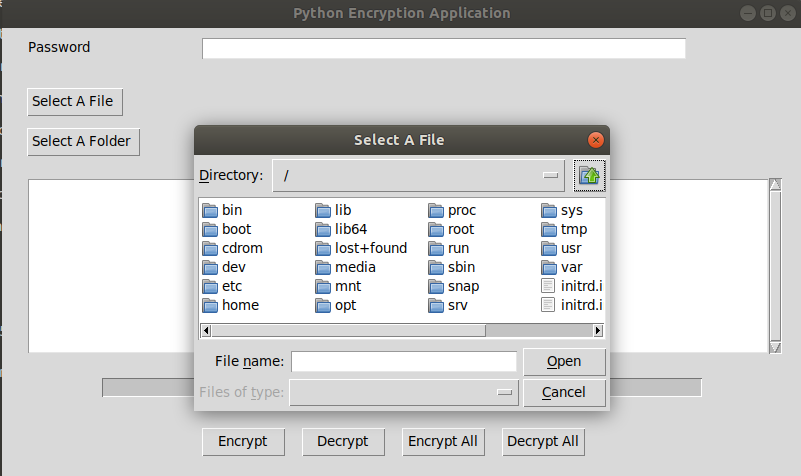
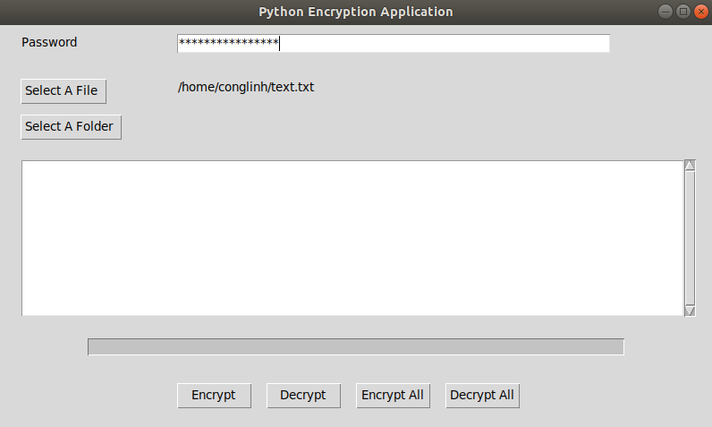
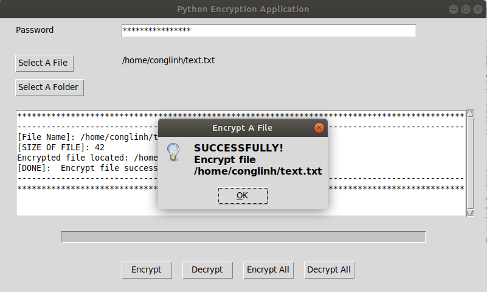
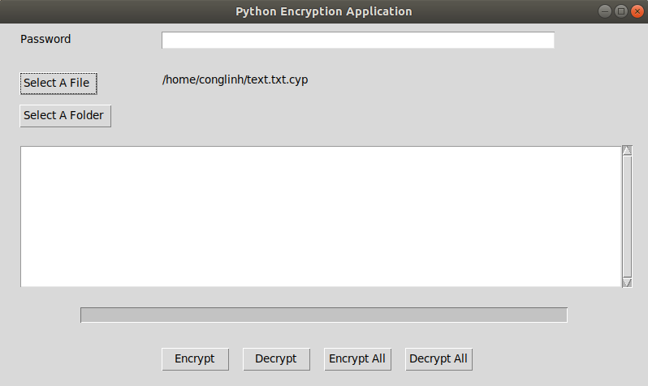
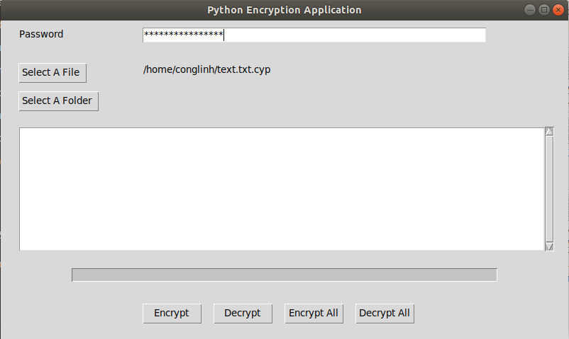
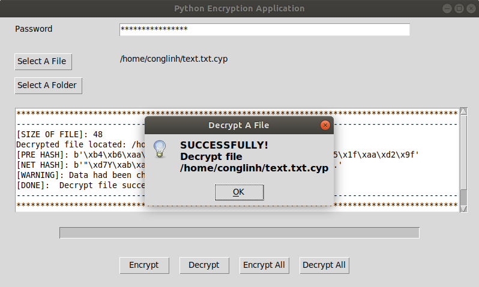

 # PyEncryptionApp
This app is built on Ubuntu Linux for encrypting and decrypting file/folder.

# Language
Python 3

# Algorithm
3DES, SHA-160, MD5

# Some packages you should install
```
pip install crypto
```
```
pip install hashlib
```
```
sudo apt-get install python-tk
```

# Demonstration
## Encrypt a file
1. Browse your file window

<p align="center">
  
</p>

2. Enter your password

<p align="center">
  
</p>

3. To start encrypting, click "Encrypt" button
<p align="center">
  
</p>

## Decrypt a file
1. Browse your file window
Note: This app only decrypts file with ".cyp" at the end

<p align="center">
  
</p>

2. Enter your password

<p align="center">
  
</p>

3. To start decrypting, click "Decrypt" button
<p align="center">
  
</p>

## For encrypting/decrypting folder, we follow all above steps

# Project member
[Lê Công Linh](https://github.com/conglinhcse)


